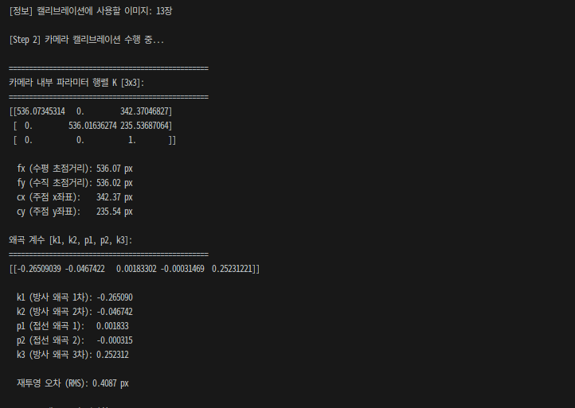
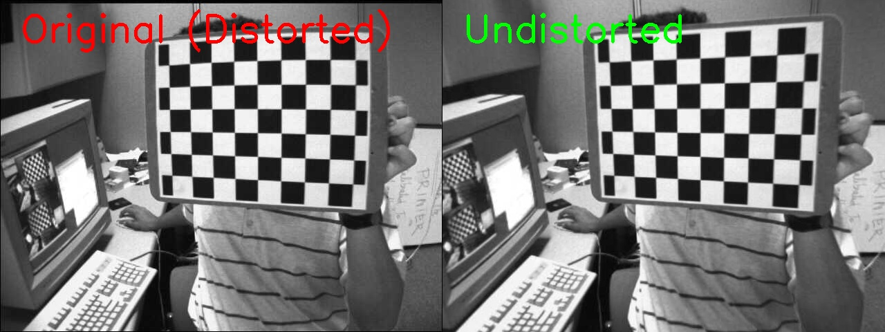
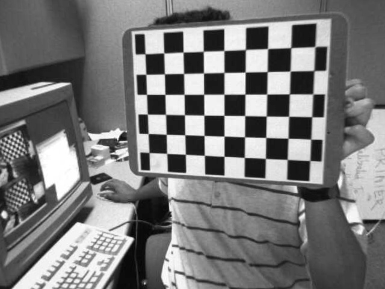

# Problem 1: 체크보드 기반 카메라 캘리브레이션

## 1. 과제 설명 (Description)

체크보드 패턴이 촬영된 여러 장의 이미지를 이용하여, 카메라의 **내부 행렬(Camera Matrix K)** 과 **왜곡 계수(Distortion Coefficients)** 를 추정하고, 왜곡 보정 결과를 시각적으로 확인하는 과제입니다.

### 요구사항
- 모든 이미지에서 체크보드 코너를 검출 (`cv2.findChessboardCorners()`)
- 검출된 코너를 정밀화 (`cv2.cornerSubPix()`)
- `cv2.calibrateCamera()`를 이용해 카메라 내부 행렬 K와 왜곡 계수 계산
- `cv2.undistort()`로 왜곡 보정 결과를 시각화

### 입력 파일
| 파일 | 설명 |
|------|------|
| `images/calibration_images/left01.jpg ~ left13.jpg` | 체크보드가 촬영된 캘리브레이션 이미지 (총 13장) |

---

## 2. 핵심 로직 설명 (Core Logic)

### 카메라 캘리브레이션 원리

카메라 캘리브레이션은 **3D 실제 좌표**와 **2D 이미지 좌표** 간의 대응 관계를 이용해 카메라 파라미터를 추정합니다.

```
[3D 실제 좌표] → [카메라 투영 모델] → [2D 이미지 좌표]
    (X, Y, Z)          K, dist            (u, v)
```

### 주요 알고리즘

1. **코너 검출**: `cv2.findChessboardCorners()`로 체크보드 내부 코너(9×6 = 54개) 위치를 픽셀 좌표로 검출
2. **코너 정밀화**: `cv2.cornerSubPix()`로 서브픽셀 정밀도로 코너 좌표를 정제
3. **캘리브레이션**: 여러 이미지의 대응 좌표들로부터 최소제곱법을 이용해 K와 dist 계산
4. **왜곡 보정**: `cv2.undistort(K, dist)`로 렌즈 왜곡 제거

### 카메라 내부 행렬 K

$$K = \begin{bmatrix} f_x & 0 & c_x \\ 0 & f_y & c_y \\ 0 & 0 & 1 \end{bmatrix}$$

- $f_x, f_y$: 초점 거리 (픽셀 단위)
- $c_x, c_y$: 주점(Principal Point) 좌표

### 왜곡 계수

| 계수 | 종류 | 설명 |
|------|------|------|
| k1, k2, k3 | 방사 왜곡 | 렌즈 중심에서 멀수록 직선이 휘는 현상 |
| p1, p2 | 접선 왜곡 | 렌즈와 이미지 센서가 완전히 평행하지 않을 때 발생 |

---

## 3. 환경 설정 및 터미널 실행 방법 (How to Run)

### Python venv를 이용한 가상환경 설정

```bash
# 1. Problem_1 폴더로 이동
cd /path/to/2week/Problem_1

# 2. Python 가상환경 생성
python3 -m venv .venv

# 3. 가상환경 활성화 (Linux/macOS)
source .venv/bin/activate

# 4. 패키지 설치
pip install -r requirements.txt

# 5. 코드 실행
python calibration.py

# 6. 가상환경 비활성화 (종료 시)
deactivate
```

### Conda를 이용한 가상환경 설정

```bash
# 1. Conda 가상환경 생성 (Python 3.10)
conda create -n cv_homework python=3.10 -y

# 2. 가상환경 활성화
conda activate cv_homework

# 3. Problem_1 폴더로 이동
cd /path/to/2week/Problem_1

# 4. 패키지 설치
pip install -r requirements.txt

# 5. 코드 실행
python calibration.py
```

---

## 4. 중간 결과 (Intermediate Results)

### 터미널 출력 로그 
 

> **재투영 오차(RMS)**: 값이 1.0 이하이면 정확한 캘리브레이션 결과입니다.

### 코너 검출 시각화


*체크보드 코너가 검출된 첫 번째 이미지. 컬러 점으로 54개의 코너 위치 표시*

---

## 5. 최종 결과 (Final Results)

### 원본 vs 왜곡 보정 비교



*왼쪽: 렌즈 왜곡이 있는 원본 이미지 / 오른쪽: 왜곡이 보정된 이미지*
*이미지 가장자리 부분에서 왜곡 보정 효과를 확인할 수 있습니다.*

### 왜곡 보정 결과 (단독)



---

## 6. 전체 코드 (Full Source Code)

```python
"""
Problem 1: 체크보드 기반 카메라 캘리브레이션 (Camera Calibration)
---
과목: 컴퓨터비전 (L02. Image Formation)
목적: 체크보드 패턴 이미지를 이용해 카메라 내부 행렬(K)과
      왜곡 계수(dist)를 추정하고, 왜곡 보정 결과를 시각화함.
"""

# OpenCV: 컴퓨터 비전 핵심 라이브러리 (이미지 처리, 캘리브레이션 등)
import cv2
# NumPy: 수치 연산 및 배열 처리 라이브러리
import numpy as np
# glob: 특정 패턴과 일치하는 파일 경로 목록을 가져오는 라이브러리
import glob
# pathlib: 파일 경로를 객체지향적으로 다루는 라이브러리
from pathlib import Path
# os: 운영체제 인터페이스 (파일/폴더 생성 등)
import os

# 체크보드 내부 코너 개수 (가로 9개, 세로 6개)
CHECKERBOARD = (9, 6)
# 체크보드 한 칸의 실제 물리적 크기 (단위: mm)
SQUARE_SIZE = 25.0
# 코너 정밀화 종료 조건
criteria = (cv2.TERM_CRITERIA_EPS + cv2.TERM_CRITERIA_MAX_ITER, 30, 0.001)

# 3D 실제 좌표 생성 (Z=0 평면)
objp = np.zeros((CHECKERBOARD[0] * CHECKERBOARD[1], 3), np.float32)
objp[:, :2] = np.mgrid[0:CHECKERBOARD[0], 0:CHECKERBOARD[1]].T.reshape(-1, 2)
objp *= SQUARE_SIZE

# 저장 리스트 초기화
objpoints = []
imgpoints = []

# 이미지 로드
script_dir = Path(__file__).parent
image_pattern = str(script_dir / "images" / "calibration_images" / "left*.jpg")
images = glob.glob(image_pattern)

if not images:
    print(f"[오류] 캘리브레이션 이미지를 찾지 못했습니다: {image_pattern}")
    exit(1)

print(f"[정보] 캘리브레이션 이미지 {len(images)}장 발견")
img_size = None

# Step 1: 코너 검출
print("\n[Step 1] 체크보드 코너 검출 시작...")
for img_path in sorted(images):
    img = cv2.imread(img_path)
    if img is None:
        print(f"  [경고] 이미지 로드 실패: {img_path}")
        continue
    gray = cv2.cvtColor(img, cv2.COLOR_BGR2GRAY)
    ret, corners = cv2.findChessboardCorners(gray, CHECKERBOARD, None)
    if ret:
        if img_size is None:
            img_size = (gray.shape[1], gray.shape[0])
        objpoints.append(objp)
        corners_refined = cv2.cornerSubPix(gray, corners, winSize=(11, 11), zeroZone=(-1, -1), criteria=criteria)
        imgpoints.append(corners_refined)
        print(f"  [성공] {Path(img_path).name}: 코너 {len(corners_refined)}개 검출")
    else:
        print(f"  [실패] {Path(img_path).name}: 코너 미검출, 제외됨")

print(f"\n[정보] 캘리브레이션에 사용할 이미지: {len(objpoints)}장")
if len(objpoints) < 3:
    print("[오류] 캘리브레이션에 충분한 이미지가 없습니다.")
    exit(1)

# Step 2: 카메라 캘리브레이션
print("\n[Step 2] 카메라 캘리브레이션 수행 중...")
ret, K, dist, rvecs, tvecs = cv2.calibrateCamera(objpoints, imgpoints, img_size, None, None)

print("\n" + "="*50)
print("카메라 내부 파라미터 행렬 K [3x3]:")
print("="*50)
print(K)
print(f"\n  fx: {K[0,0]:.2f} px,  fy: {K[1,1]:.2f} px")
print(f"  cx: {K[0,2]:.2f} px,  cy: {K[1,2]:.2f} px")
print("\n왜곡 계수 [k1, k2, p1, p2, k3]:")
print(dist)
print(f"\n  재투영 오차 (RMS): {ret:.4f} px")

# Step 3: 왜곡 보정 시각화
print("\n[Step 3] 왜곡 보정 시각화 중...")
output_dir = script_dir / "outputs"
output_dir.mkdir(parents=True, exist_ok=True)

original = cv2.imread(sorted(images)[0])
undistorted = cv2.undistort(original, K, dist, None, K)

h, w = original.shape[:2]
comparison = np.hstack([original, undistorted])
cv2.putText(comparison, "Original (Distorted)", (30, 60), cv2.FONT_HERSHEY_SIMPLEX, 1.8, (0, 0, 255), 3)
cv2.putText(comparison, "Undistorted", (w + 30, 60), cv2.FONT_HERSHEY_SIMPLEX, 1.8, (0, 255, 0), 3)

cv2.imwrite(str(output_dir / "comparison_undistortion.jpg"), comparison)
cv2.imwrite(str(output_dir / "undistorted.jpg"), undistorted)

corner_vis_img = cv2.imread(sorted(images)[0])
cv2.drawChessboardCorners(corner_vis_img, CHECKERBOARD, imgpoints[0], True)
cv2.imwrite(str(output_dir / "detected_corners.jpg"), corner_vis_img)

print("\n[완료] 카메라 캘리브레이션이 성공적으로 완료되었습니다!")
```
