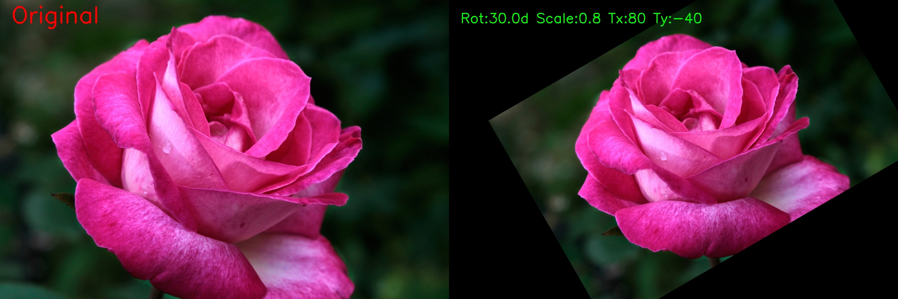

# Problem 2: 이미지 Rotation & Transformation

## 1. 과제 설명 (Description)

한 장의 이미지에 아핀 변환(Affine Transformation)을 적용하여 **회전(Rotation)**, **크기 조절(Scaling)**, **평행이동(Translation)** 을 수행하는 과제입니다.

### 요구사항
| 변환 | 파라미터 | 설명 |
|------|----------|------|
| 회전 | +30도 | 이미지 중심 기준 반시계 방향 30도 회전 |
| 크기 조절 | 0.8배 | 이미지를 80% 크기로 축소 |
| 평행이동 | x: +80px, y: -40px | x축 오른쪽으로 80px, y축 위로 40px 이동 |

### 입력 파일
| 파일 | 설명 |
|------|------|
| `images/rose.png` | 변환 대상 이미지 (장미 사진) |

---

## 2. 핵심 로직 설명 (Core Logic)

### 아핀 변환(Affine Transformation) 이란?

아핀 변환은 2D 이미지에 **회전, 크기 조절, 평행이동**을 동시에 적용할 수 있는 2×3 행렬 기반의 선형 변환입니다.

$$\begin{bmatrix} x' \\ y' \end{bmatrix} = M \cdot \begin{bmatrix} x \\ y \\ 1 \end{bmatrix}$$

$$M = \begin{bmatrix} \alpha & \beta & t_x \\ -\beta & \alpha & t_y \end{bmatrix}$$

여기서:
- $\alpha = scale \cdot \cos(\theta)$
- $\beta = scale \cdot \sin(\theta)$  
- $t_x, t_y$: 평행이동 값

### 처리 순서

```
1. cv2.getRotationMatrix2D(center, angle=30, scale=0.8)
       → 회전 + 스케일 행렬 M 생성
       
2. M[0,2] += 80, M[1,2] += (-40)
       → 평행이동 값을 행렬의 마지막 열에 반영

3. cv2.warpAffine(img, M, (w, h))
       → 이미지에 변환 행렬 M 적용
```

### 핵심 함수

| 함수 | 역할 |
|------|------|
| `cv2.getRotationMatrix2D(center, angle, scale)` | 2×3 회전+스케일 변환 행렬 생성 |
| `cv2.warpAffine(src, M, dsize)` | 이미지에 아핀 변환 적용 |

---

## 3. 환경 설정 및 터미널 실행 방법 (How to Run)

### Python venv를 이용한 가상환경 설정

```bash
# 1. Problem_2 폴더로 이동
cd /path/to/2week/Problem_2

# 2. Python 가상환경 생성
python3 -m venv .venv

# 3. 가상환경 활성화 (Linux/macOS)
source .venv/bin/activate

# 4. 패키지 설치
pip install -r requirements.txt

# 5. 코드 실행
python transform.py

# 6. 가상환경 비활성화 (종료 시)
deactivate
```

### Conda를 이용한 가상환경 설정

```bash
# 1. Conda 가상환경 생성 (Python 3.10)
conda create -n cv_homework python=3.10 -y

# 2. 가상환경 활성화
conda activate cv_homework

# 3. Problem_2 폴더로 이동
cd /path/to/2week/Problem_2

# 4. 패키지 설치
pip install -r requirements.txt

# 5. 코드 실행
python transform.py
```

---

## 4. 중간 결과 (Intermediate Results)

### 터미널 출력 로그 


### 변환 행렬 시각화

변환 전후의 좌표 변화를 보여주는 아핀 행렬이 콘솔에 출력됩니다.

---

## 5. 최종 결과 (Final Results)

### 원본 vs 변환 이미지 비교



*왼쪽: 원본 이미지 / 오른쪽: 회전(+30도) + 크기 조절(0.8배) + 평행이동(x:+80, y:-40) 적용*

### 변환된 이미지 (단독)


### 결과 요약
```
변환 파라미터 요약:
==================================================
  회전 각도 : 30.0도 (이미지 중심 기준, 반시계)
  크기 조절 : 0.8배 (80% 축소)
  평행이동  : x축 +80px (오른쪽), y축 -40px (위쪽)
```

---

## 6. 전체 코드 (Full Source Code)

```python
"""
Problem 2: 이미지 Rotation & Transformation (회전 & 변환)
"""

import cv2
import numpy as np
from pathlib import Path

# 이미지 로드
script_dir = Path(__file__).parent
image_path = script_dir / "images" / "rose.png"
img = cv2.imread(str(image_path))

if img is None:
    print(f"[오류] 이미지를 찾을 수 없습니다: {image_path}")
    exit(1)

print(f"[정보] 이미지 로드 완료: {image_path}")
print(f"       크기: 가로 {img.shape[1]}px × 세로 {img.shape[0]}px")

# 변환 파라미터 설정
ROTATION_ANGLE = 30.0    # 회전 각도 (+: 반시계)
SCALE_FACTOR   = 0.8     # 크기 조절 비율
TX = 80                   # x축 평행이동 (+: 오른쪽)
TY = -40                  # y축 평행이동 (-: 위쪽)

# Step 1: 회전 행렬 생성
h, w = img.shape[:2]
center = (w / 2, h / 2)  # 이미지 중심점
print(f"\n[Step 1] 회전+스케일 행렬 생성")
M = cv2.getRotationMatrix2D(center, ROTATION_ANGLE, SCALE_FACTOR)
print(f"         생성된 회전 행렬:\n{M}")

# Step 2: 평행이동 반영
print(f"\n[Step 2] 평행이동 반영: x={TX}px, y={TY}px")
M[0, 2] += TX  # x축 이동
M[1, 2] += TY  # y축 이동
print(f"         평행이동 반영 후 행렬:\n{M}")

# Step 3: 아핀 변환 적용
print(f"\n[Step 3] 아핀 변환 적용 중...")
transformed = cv2.warpAffine(img, M, (w, h))
print(f"         변환 완료! 출력 크기: {w}x{h}")

# Step 4: 결과 저장
print(f"\n[Step 4] 결과 저장 중...")
output_dir = script_dir / "outputs"
output_dir.mkdir(parents=True, exist_ok=True)

comparison = np.hstack([img, transformed])
cv2.putText(comparison, "Original",
            (30, 60), cv2.FONT_HERSHEY_SIMPLEX, 2.0, (0, 0, 255), 3)
cv2.putText(comparison, f"Rot:{ROTATION_ANGLE}d Scale:{SCALE_FACTOR} Tx:{TX} Ty:{TY}",
            (w + 30, 60), cv2.FONT_HERSHEY_SIMPLEX, 1.2, (0, 255, 0), 2)

cv2.imwrite(str(output_dir / "comparison_transform.jpg"), comparison)
cv2.imwrite(str(output_dir / "transformed.jpg"), transformed)
cv2.imwrite(str(output_dir / "original.jpg"), img)

print("\n" + "="*50)
print("변환 파라미터 요약:")
print("="*50)
print(f"  회전 각도 : {ROTATION_ANGLE}도 (이미지 중심 기준, 반시계)")
print(f"  크기 조절 : {SCALE_FACTOR}배 ({int(SCALE_FACTOR * 100)}% 축소)")
print(f"  평행이동  : x축 +{TX}px (오른쪽), y축 {TY}px (위쪽)")
print("\n[완료] 이미지 변환이 성공적으로 완료되었습니다!")
```
