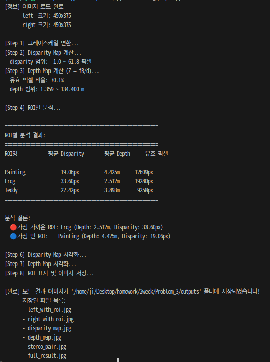
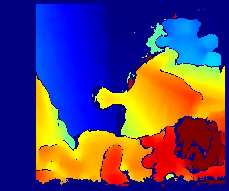
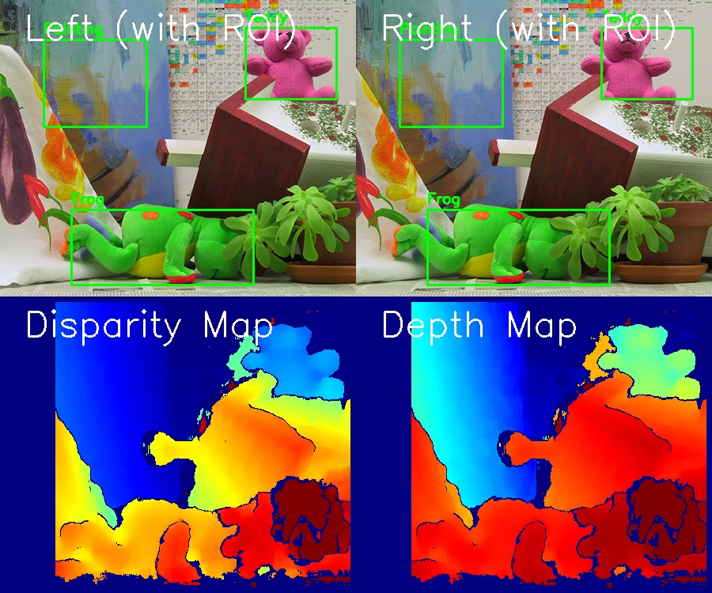
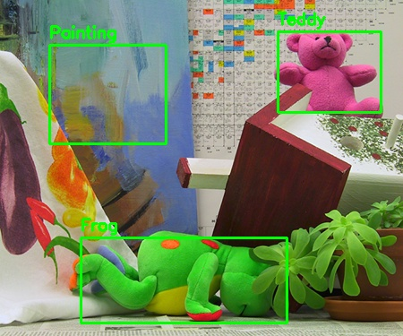
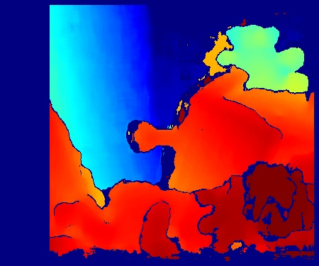

# Problem 3: Stereo Disparity 기반 Depth 추정

## 1. 과제 설명 (Description)

좌측(Left)과 우측(Right) 스테레오 카메라로 촬영한 이미지 쌍을 이용해 **Disparity Map**을 계산하고, 삼각측량 공식 **Z = fB/d** 를 통해 각 픽셀의 **Depth(깊이)** 를 추정하는 과제입니다.

### 요구사항
- 입력 이미지를 그레이스케일로 변환 후 `cv2.StereoBM_create()`로 Disparity Map 계산
- Disparity > 0인 픽셀만 사용하여 Depth Map 계산
- **ROI (Painting, Frog, Teddy)** 각각에 대해 평균 Disparity와 평균 Depth 비교
- 가장 가까운 ROI와 가장 먼 ROI 해석

### 카메라 파라미터
| 파라미터 | 값 | 설명 |
|----------|-----|------|
| f (초점거리) | 700.0 px | 카메라의 초점 거리 (픽셀 단위) |
| B (베이스라인) | 0.12 m | 두 카메라 사이의 거리 |

### 입력 파일
| 파일 | 설명 |
|------|------|
| `images/left.png` | 왼쪽 카메라 이미지 |
| `images/right.png` | 오른쪽 카메라 이미지 |

---

## 2. 핵심 로직 설명 (Core Logic)

### Stereo Vision 원리

두 카메라의 시점 차이로 인해 같은 물체가 두 이미지에서 다른 위치에 찍힙니다. 이 위치 차이를 **Disparity(시차)** 라고 하며, 이를 이용해 깊이를 계산합니다.

```
          Left Camera      Right Camera
               |                |
               |<--  B (baseline) -->|
               |                |
               (f: focal length)
               
  물체 P ────────────────────────────── 깊이 Z
```

### Depth 계산 공식

$$Z = \frac{f \cdot B}{d}$$

| 변수 | 의미 | 단위 |
|------|------|------|
| Z | 물체까지의 깊이 | m |
| f | 초점 거리 | px |
| B | 두 카메라 사이 거리 (Baseline) | m |
| d | Disparity (픽셀 위치 차이) | px |

> **핵심 관계**: Disparity ↑ → Depth ↓ (가까울수록 disparity가 크다!)

### StereoBM 알고리즘

`cv2.StereoBM_create()`는 **블록 매칭(Block Matching)** 방식을 사용합니다:
- 좌측 이미지의 각 블록과 가장 유사한 블록을 우측 이미지에서 탐색
- 두 블록의 수평 위치 차이 = Disparity
- 반환값은 **16배 스케일** 된 정수값이므로 16.0으로 나눠야 실제 Disparity

### ROI 설정
| ROI | 위치 (x, y, w, h) | 설명 |
|-----|-------------------|------|
| Painting | (55, 50, 130, 110) | 그림 영역 |
| Frog | (90, 265, 230, 95) | 개구리 영역 |
| Teddy | (310, 35, 115, 90) | 테디베어 영역 |

---

## 3. 환경 설정 및 터미널 실행 방법 (How to Run)

### Python venv를 이용한 가상환경 설정

```bash
# 1. Problem_3 폴더로 이동
cd /path/to/2week/Problem_3

# 2. Python 가상환경 생성
python3 -m venv .venv

# 3. 가상환경 활성화 (Linux/macOS)
source .venv/bin/activate

# 4. 패키지 설치
pip install -r requirements.txt

# 5. 코드 실행
python depth.py

# 6. 가상환경 비활성화 (종료 시)
deactivate
```

### Conda를 이용한 가상환경 설정

```bash
# 1. Conda 가상환경 생성 (Python 3.10)
conda create -n cv_homework python=3.10 -y

# 2. 가상환경 활성화
conda activate cv_homework

# 3. Problem_3 폴더로 이동
cd /path/to/2week/Problem_3

# 4. 패키지 설치
pip install -r requirements.txt

# 5. 코드 실행
python depth.py
```

---

## 4. 중간 결과 (Intermediate Results)

### 터미널 출력 로그 


 


### Disparity Map (처리 과정)



*JET 컬러맵 적용: 빨강(가까운 물체, 높은 disparity) ~ 파랑(먼 물체, 낮은 disparity)*

---

## 5. 최종 결과 (Final Results)

### 전체 결과 그리드



*상단: 좌/우 원본 이미지 (ROI 표시) / 하단: Disparity Map, Depth Map*

### ROI 분석 결과



*초록 사각형으로 표시된 3개의 ROI (Painting, Frog, Teddy)*

### Depth Map 시각화



*JET 컬러맵 적용: 빨강(가까운 물체, 낮은 depth) ~ 파랑(먼 물체, 높은 depth)*

### 분석 결론

| ROI | 평균 Disparity | 평균 Depth | 순위 |
|-----|---------------|------------|------|
| **Frog** | **33.60 px** | **2.512 m** | 🔴 1위 (가장 가까움) |
| Teddy | 22.42 px | 3.893 m | 2위 |
| Painting | 19.06 px | 4.425 m | 🔵 3위 (가장 멂) |

> **결론**: **Frog(개구리)** 가 가장 가깝고 (Depth 2.512m), **Painting(그림)** 이 가장 멀다 (Depth 4.425m).  
> Disparity가 클수록 가까운 물체임을 확인 (Frog: 33.60px > Teddy: 22.42px > Painting: 19.06px)

---

## 6. 전체 코드 (Full Source Code)

```python
"""
Problem 3: Stereo Disparity 기반 Depth 추정
Z = fB/d 공식 이용
"""

import cv2
import numpy as np
from pathlib import Path

# 경로 설정
script_dir = Path(__file__).parent
left_path  = script_dir / "images" / "left.png"
right_path = script_dir / "images" / "right.png"
output_dir = script_dir / "outputs"
output_dir.mkdir(parents=True, exist_ok=True)

# 이미지 로드
left_color  = cv2.imread(str(left_path))
right_color = cv2.imread(str(right_path))

if left_color is None or right_color is None:
    raise FileNotFoundError("좌/우 이미지를 찾지 못했습니다.")

# 카메라 파라미터
f = 700.0   # 초점 거리 (픽셀)
B = 0.12    # 베이스라인 (m)

# ROI 설정
rois = {
    "Painting": (55,  50,  130, 110),
    "Frog":     (90,  265, 230, 95),
    "Teddy":    (310, 35,  115, 90),
}

# Step 1: 그레이스케일 변환
left_gray  = cv2.cvtColor(left_color,  cv2.COLOR_BGR2GRAY)
right_gray = cv2.cvtColor(right_color, cv2.COLOR_BGR2GRAY)

# Step 2: Disparity Map 계산
stereo = cv2.StereoBM_create(numDisparities=64, blockSize=15)
raw_disparity = stereo.compute(left_gray, right_gray)
disparity = raw_disparity.astype(np.float32) / 16.0  # 실제 disparity 값

# Step 3: Depth Map 계산 (Z = fB/d)
valid_mask = disparity > 0
depth_map = np.zeros_like(disparity, dtype=np.float32)
depth_map[valid_mask] = (f * B) / disparity[valid_mask]

# Step 4: ROI별 분석
results = {}
for name, (x, y, w, h) in rois.items():
    roi_disp  = disparity[y:y+h, x:x+w]
    roi_depth = depth_map[y:y+h, x:x+w]
    roi_valid = valid_mask[y:y+h, x:x+w]
    if roi_valid.sum() > 0:
        results[name] = {
            "avg_disparity": roi_disp[roi_valid].mean(),
            "avg_depth_m":   roi_depth[roi_valid].mean(),
        }

# Step 5: 결과 출력
print(f"\n{'ROI명':<12} {'평균 Disparity':>15} {'평균 Depth':>15}")
for name, data in results.items():
    print(f"{name:<12} {data['avg_disparity']:>14.2f}px {data['avg_depth_m']:>14.3f}m")

valid_results = {k: v for k, v in results.items() if v['avg_depth_m'] != float('inf')}
closest  = min(valid_results, key=lambda k: valid_results[k]['avg_depth_m'])
farthest = max(valid_results, key=lambda k: valid_results[k]['avg_depth_m'])
print(f"\n🔴 가장 가까운 ROI: {closest}")
print(f"🔵 가장 먼 ROI:    {farthest}")

# Step 6-7: 시각화
disp_tmp = disparity.copy()
disp_tmp[disp_tmp <= 0] = np.nan
d_min = np.nanpercentile(disp_tmp, 5)
d_max = np.nanpercentile(disp_tmp, 95)
if d_max <= d_min: d_max = d_min + 1e-6
disp_scaled = np.clip((disp_tmp - d_min) / (d_max - d_min), 0, 1)
disp_vis = np.zeros_like(disparity, dtype=np.uint8)
valid_disp = ~np.isnan(disp_tmp)
disp_vis[valid_disp] = (disp_scaled[valid_disp] * 255).astype(np.uint8)
disparity_color = cv2.applyColorMap(disp_vis, cv2.COLORMAP_JET)

depth_vis = np.zeros_like(depth_map, dtype=np.uint8)
if np.any(valid_mask):
    depth_valid = depth_map[valid_mask]
    z_min = np.percentile(depth_valid, 5)
    z_max = np.percentile(depth_valid, 95)
    if z_max <= z_min: z_max = z_min + 1e-6
    depth_scaled = 1.0 - np.clip((depth_map - z_min) / (z_max - z_min), 0, 1)
    depth_vis[valid_mask] = (depth_scaled[valid_mask] * 255).astype(np.uint8)
depth_color = cv2.applyColorMap(depth_vis, cv2.COLORMAP_JET)

# Step 8: ROI 표시
left_vis = left_color.copy()
for name, (x, y, w, h) in rois.items():
    cv2.rectangle(left_vis, (x, y), (x+w, y+h), (0, 255, 0), 2)
    cv2.putText(left_vis, name, (x, y-8), cv2.FONT_HERSHEY_SIMPLEX, 0.6, (0, 255, 0), 2)

# Step 9: 저장
cv2.imwrite(str(output_dir / "left_with_roi.jpg"), left_vis)
cv2.imwrite(str(output_dir / "disparity_map.jpg"), disparity_color)
cv2.imwrite(str(output_dir / "depth_map.jpg"), depth_color)

h_img, w_img = left_color.shape[:2]
top_row = np.hstack([left_vis, cv2.resize(right_color.copy(), (w_img, h_img))])
bot_row = np.hstack([cv2.resize(disparity_color, (w_img, h_img)),
                     cv2.resize(depth_color, (w_img, h_img))])
cv2.imwrite(str(output_dir / "full_result.jpg"), np.vstack([top_row, bot_row]))

print("\n[완료] 모든 결과 이미지 저장 완료!")
```
